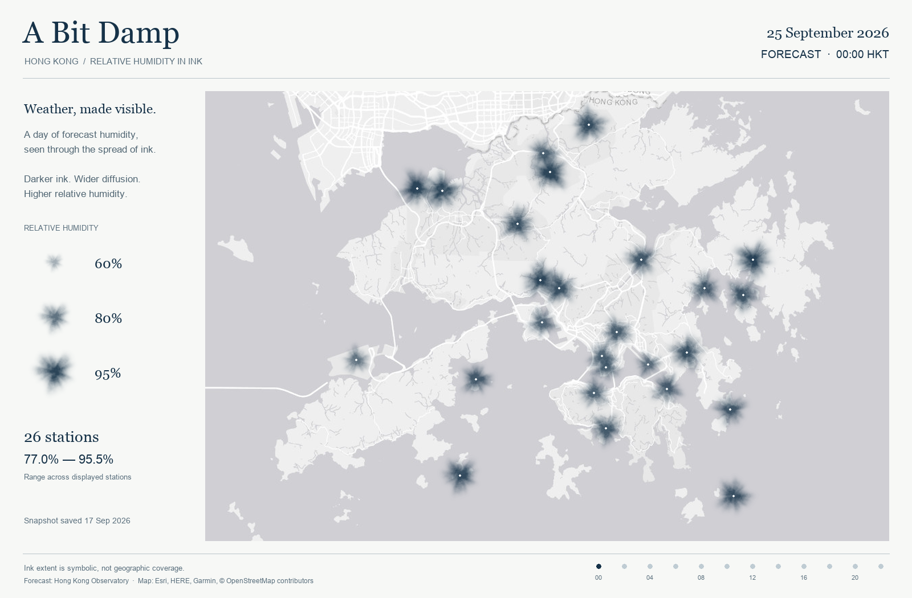

# The phenomenon
Hong Kong’s relative humidity, visualised through ink.
A Bit Damp explores how forecast relative humidity varies across Hong Kong over a single day. Relative humidity describes how close the air is to saturation at its current temperature; it is not a direct measurement of rainfall or the total amount of water vapour in the air.




## The source
The data comes from the [Hong Kong Observatory’s regional weather forecast](https://www.hko.gov.hk/sc/wxinfo/awsgis/regional_portal.html?ele=rh). This project uses a snapshot saved on 17 September 2026, containing forecasts for 25 September 2026. These are forecast values, not observations recorded on that day.

## What the picture shows
The picture highlights differences between locations and changes throughout the day. A fixed visual scale makes stations and frames comparable.
However, the ink is a symbolic representation: its footprint does not show the geographical area affected by a station or simulate moisture spreading. Overlapping spots may appear darker. The artistic mapping emphasises humidity between 50% and 100%; ink area is not directly proportional to humidity.
Sampling every two hours leaves out the intervening hourly values. The animation also does not show forecast uncertainty, temperature, or conditions between stations. Exact values are available in the interactive map’s station popups. Replaying the animation repeats the same day, not a forecast for the following day.

## Run it

```
# Use the saved forecast files and cache the basemap if needed.
uv run fetch.py

# Generate the still image and 12-frame animated WebP.
uv run plot.py

# Generate only the still image.
uv run plot.py --still

# Generate the interactive Folium map.
uv run plot_web.py
```
